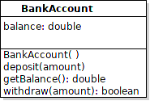

Based on "10 Minute Tutorial" at Cucumber.io <https://cucumber.io/docs/guides/10-minute-tutorial/>

### Preliminary Setup

- Install Gradle 6 or newer, and verify that `gradle` is on your command search path.
- In a terminal or command window, type `gradle --version`. 
- Create an empty project directory and `cd` to that directory. I used "cucumber-demo" as the directory name.

### Demo Steps, Part 1

1. Using a terminal (command line) in an empty project directory, enter `gradle init`.    
  In the "gradle init" dialog, choose:
   * 2: application (the Project type)
   * 3: Java
   * 1: no - only one application in this project
   * 1: Groovy DSL
   * 1: JUnit 4
   * Project name: cucumber-demo (or whatever your directory name is)
   * Source package: **demo**

2. Move contents of the "app" subdirectory to the project directory (as in older Gradle projects).
   * enter: `mv app/* .`
   * delete the "app" dir: `rmdir app`
   * edit `settings.gradle` and delete the line `include('app')`

3. Edit `build.gradle` and add cucumber dependencies.    
   JUnit is not required to run Cucumber, but we will use JUnit in this demo.
   ```
   dependencies {
       // Use JUnit test framework.
       testImplementation 'junit:junit:4.13'
       ...

       // Cucumber
       testImplementation 'io.cucumber:cucumber-java:6.10.4'
       testImplementation 'io.cucumber:cucumber-junit:6.10.4'
   }
   ```

4. Also in `build.gradle` add cucumber task and configuration (at the end of the file).
   ```groovy
   configurations {
       cucumberRuntime {
           extendsFrom testImplementation
       }
   }

   task cucumber() {
       dependsOn assemble, testClasses
       doLast {
        javaexec {
            main = "io.cucumber.core.cli.Main"
            classpath = configurations.cucumberRuntime + sourceSets.main.output + sourceSets.test.output
            args = ['--plugin', 'pretty', '--glue', 'demo', 'src/test/resources']
            // other args = ['--snippets', 'camelcase']
        }
       }
   }
   ```

6. Verify that you have this directory in our project: `src/test/resources`.   
   This directory is where you put "feature" files and is referred to in the `javaexec` line above.
   - TODO  Explain what the javaexec command means

7. Run `gradle cucumber`.  It should succeed.
   * Windows Users: On some Windows version, the output of cucmber shows character escape sequences instead of colored text.  There are 2 solutions to this:
     1. Use the Git/Bash or Bash shell
     2. In the `args` list of the `cucumber` task, add a `"-m"` argument (monochrome output).

8. (Optional) To supress the verbose output about sharing code, create a file `src/test/resources/cucumber.properties` containing these lines:
   ```
   cucumber.publish.quiet=true
   # for Java, use camelcase method names in snippet code
   #cucumber.snippet-type=camelcase
   ```

9. Create a feature file in directory `src/test/resources/features` (the `resources` directory itself or any subdir can be used. This directory does not need to match the package where your code will be.)
   ```
   deposit_money.feature
   ```

10. Write a feature and some scenarios in the deposit\_money.feature file:
   ```gherkin
    Feature: Make deposits and see the account balance.

    Scenario: open a new account
      Given I open a bank account
      Then the balance is 0

    Scenario: deposit to an account
      Given I open a bank account
      When I deposit 100
      Then the balance is 100
   ```

11. Run `gradle cucumber` again.  This time is fails due to "Undefined scenarios".
    Notice the output includes suggested "glue" code for each undefined "Step" in the Scenarios.  Here is glue code for the first step:
   ```java
    @Given("I open a bank account")
    public void i_open_a_bank_account() {
        // Write code here that turns the phrase above into concrete actions
        throw new io.cucumber.java.PendingException();
    }
   ```

12. This "glue" code is using snake case. For Java we should use CamelCase. Edit `src/test/resources/cucumber.properties` and uncomment the line:    
`cucumber.snippet-type=camelcase`  
    * Another solution is to edit `build.gradle` and add "--snippets", "camelcase" to the "args" list of the `javaexec` command. 

13. Run `gradle cucumber` again. The code snippets should now use camelCase.    
    **Copy the code snippets**. 

14. Create a glue file (a Java class) in src/test/java/demo/ named `BankAccountTest.java`
    - Be sure to use the correct package name (`demo`).
    - See example [Java glue file below](#glue-code)

15. (Optional) To verify that your Java code is correct, run `gradle build`. Otherwise, it will be built as part of the next step...

15. Run `gradle cucumber` again.
    - This time it should match the **Steps** in your feature file with Glue code using the annotation.
    - But, the glue code throws a `PendingException`, which means that you did not write any useful glue code yet.

16. In the glue code (`BankAccountTest.java`) replace the PendingException lines with some System.out.println() commands.  For example:
    ```java
    @Given("I open a bank account")
    public void iOpenABankAccount() {
        System.out.println("You opened a bank account.");
    }
    ```

In the next part, we'll write code for the BankAccount class and use Glue Code to test the class.

### Structure of your Project

Now you should have a project structure like this:
```
build.gradle
gradle/
gradlew
README.md
settings.gradle
src/
    main/java/
             demo/
    test/resources/
             cucumber.properties
             features/
                 (your feature files go here)
                 deposit_money.feature
        /java/demo/
                 (your "glue" code goes here)
                 BankAccountTest.java
```

### Feature Files

Example of `deposit_money.feature`
```gherkin
Feature: Make deposits to a bank account
  A customer can deposit to a bank account and his balance is updated.

  Scenario: open a new account
    Given I open a bank account
    Then the balance is 0

  Scenario: deposit to an account
    Given I open a bank account
    When I deposit 100
    Then the balance is 100
```

After you add glue code for those, add more scenarios like this:
```gherkin
  Scenario: make several deposits to an account
    Given I open a bank account
    When I deposit 100
     And I deposit 30
     And I deposit 25
    Then the balance is 155
```


### Glue Code

**Where to put the glue code?**  Glue Code files can have **any name**, but they should be in a **package** that cucumber is configured to look in.  In `build.gradle` we wrote  (the `--glue` argument) that this package is "`demo`". Glue code can be in multiple packages or use a hierarchy of packages.

Many Cucumber tutorials create a file named `StepDefinitions.java`. IntelliJ uses this name, too.  This name is not necessary.

Here is the glue code for the first two scenarios shown above:
```java
package demo;
import io.cucumber.java.en.Given;
import io.cucumber.java.en.Then;
import io.cucumber.java.en.When;

public class BankAccountTest {
    @Given("I open a bank account")
    public void iOpenABankAccount() {
        System.out.println("You opened a bank account.");
    }
    
    @Then("the balance is {int}")
    public void theBalanceIs(Integer balance) {
        System.out.printf("Your balance is %d\n", balance);
    }
    
    @When("I deposit {int}")
    public void iDeposit(Integer amount) {
        System.out.printf("You deposited %d\n", amount);
    }
}
```
This code contains a few edits:

* Replaced `@PendingException` with System.out.println(...).
* Add a `package`.
* `import` cucumber annotations. You can also import "And" and "But", if desired.
* Change the default parameter names (`int1`) to meaningful names.

### Replace 'int' with 'double'?

Cucumber saw that our Steps contained an integer, so it generated pattern strings that match an 'int' value.  We could use '{double}' instead of '{int}', and it would match both integer and decimal values in the feature steps.  An example of glue code using double is:
```java
    @Then("the balance is {double}")
    public void theBalanceIs(Double balance) {
        System.out.printf("Your balance is %d\n", balance);
    }
```

### Demo Steps, Part 2

Next, let's create a BankAccount class and test it. This is a lame model for a BankAccount (using "double" for money values and no transaction logging).



`BankAccount.java` should be in the "main" source tree, `src/main/java/demo/BankAccount.java`.

```java
package demo;
public class BankAccount {
    private double balance;

    /** Initialize a new BankAccount. */
    public BankAccount() {
        this.balance = 0;
    }

    /** Deposit money. */
    public void deposit(double amount) {
        this.balance += amount;
    }

    public double getBalance() {
        return this.balance
    }


    /** Withdraw money, but not exceeding the balance. */
    public boolean withdraw(double amount) {
        if (amount < balance) {    // BUG
           this.balance -= amount;
           return true;
        }
        return false;              // insufficient funds
    }
}
```

Run `gradle build` to check your code for syntax errors.

Then, modify your glue code (BankAccountTest.java) to test the BankAccount.

1. Import Junit for tests and add a BankAccount test fixture:
   ```java
   package demo;
   import static org.junit.Assert.*;

   public class BankAccountTest {
       // fixture for tests
       private BankAccount account;
       // tolerance for comparing double values
       static final double TOL = 1.0E-4;

       @Given("I open a bank account")
       public void iOpenABankAccount() {
           account = new BankAccount();
       }
    
       @Then("the balance is {int}")
       public void theBalanceIs(Integer balance) {
           // assertEquals( expected, actual, tolerance)
           assertEquals(balance, account.getBalance(), TOL);
       }

       //Todo: write the @When code for deposit
   }
   ```
2. Compile and run with cucumber: `gradle cucumber`

3. To verify the tests are *really* performed, add a scenario that should fail:
   ```gherkin
    Scenario Bank Account does not have free money
      Given I open a bank account
      Then the balance is 20
    ```

4. Compile and run this with Cucumber.  The new scenario should fail with an "assert" error from JUnit.

### Next Step (on your own)

1. Create a new feature file to test the withdraw behavior.  Write some scenarios for withdraw.

2. Add the glue code to BankAccountTest.java. 


### You Don't Need Gradle or Maven to Use Cucumber

You can run Cucumber on the command with only a JRE (or JDK)
and the Cucumber and Gherkin JAR files. Gradle, Maven, or Any aren't necessary.

It is instructive to use Cucumber with only the CLI.

You can use Cucumber in a project in any supported language, including Ruby, Python, and PHP.

---
### References

* Cucumber Home <https://cucumber.io>
* Cucumber 10 Minute Tutorial <https://cucumber.io/docs/guides/10-minute-tutorial/#make-it-pass> shows how to configure Gradle for cucumber.
* Introduction to Gherkin and writing feature files: <https://youtu.be/lC0jzd8sGIA>
* [Black-box and White-box Testing][] course on [Coursera](https://coursera.org).  You can audit the course for free. Week 3 of this course contains a useful video introduction to BDD and Cucumber.  There are also short video segments on regular expressions.
* BDD: Automation Testing with Cucumber <https://www.bornfight.com/blog/behavior-driven-development-automation-testing-with-cucumber/>

[Black-box and White-box Testing]: https://www.coursera.org/learn/black-box-white-box-testing/home/welcome
